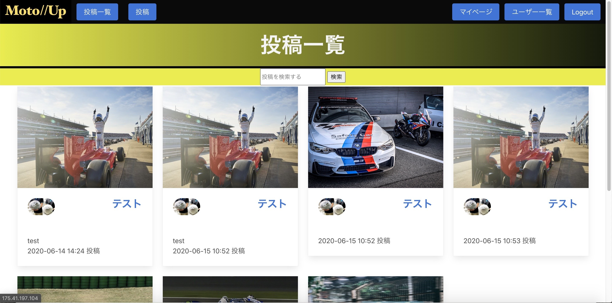

# MotoUp
## 概要
モータースポーツ関連の写真Upアプリになります。 
タイトルは、もっと（Moto）写真をUpして欲しいとモーターのMotoを掛け合わせたタイトルになっております。 
※投稿画像については、フリー画像です。

## 本番環境
http://175.41.197.104/
#### ログインアカウント
email:motoup@gmail.com 
pass:123456
# 制作背景
１つ目に、モータースポーツのみに限った、手軽に投稿できる写真Upアプリが存在しなかったことがあります。 
そして、これは私の考えですが、素敵な、かっこいい写真を最も多く所有しているのは、そのモータースポーツの公式さんや、専属のカメラマンではなく一般の方々じゃないかなと思っています。その写真を自慢できる、共有できるアプリがあったらいいなと思い制作いたしました。 
この、アプリのターゲット層は、モータスポーツ好き、興味がある人達です。
## 工夫した点
とにかく、使いやすさ・見やすさを重視したアプリにしています。
## 使用技術
macOS Catalina 10.15.5 
HTML5 
CSS3 
Ruby 2.5.1 
Ruby on Rails 5.2.4.3 
Mysql 
AWS 
## 今後実装したい機能
お気に入り機能 
